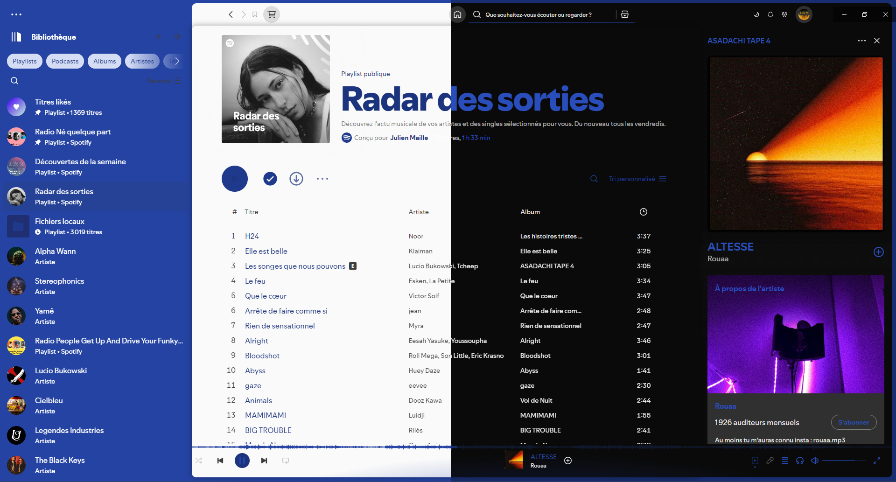

# DribbblishDynamic for [Spicetify](https://github.com/spicetify/cli) <a href="https://github.com/JulienMaille/dribbblish-dynamic-theme/releases/latest"></a>

This is a tweaked version of the Dribbblish theme.  
The main differences are the [automated](#follow-system-darklight-theme) light/dark toggle, the background cover and the dynamic highlight color, ie. it will match the current album art.

## Preview



## Install / Update
> [!IMPORTANT]
> Make sure you are using latest releases of <a href="https://github.com/spicetify/cli/releases/latest"></a> and [Spotify](https://www.spotify.com/us/download/other/)  
> The easiest way is probably to install this theme from the <a href="https://github.com/spicetify/marketplace/wiki/Installation#auto-install"></a>, developed by the same team behind Spicetify.

#### Windows (PowerShell)

```powershell
Invoke-WebRequest -UseBasicParsing "https://raw.githubusercontent.com/JulienMaille/dribbblish-dynamic-theme/master/install.ps1" | Invoke-Expression
```

#### Linux/MacOS (Bash)

```bash
curl -fsSL https://raw.githubusercontent.com/JulienMaille/dribbblish-dynamic-theme/master/install.sh | sh
```

#### Manual Install

1. Download the latest [Source code (zip)](https://github.com/JulienMaille/dribbblish-dynamic-theme/releases/latest)
2. Extract the files to your [Spicetify/Themes folder](https://spicetify.app/docs/development/themes/) (rename the zipped folder to `DribbblishDynamic`)
3. Copy `dribbblish-dynamic.js` and `Vibrant.min.js` to your [Spicetify/Extensions folder](https://spicetify.app/docs/advanced-usage/extensions#installing)
4. Run:
    ```
    spicetify config extensions dribbblish-dynamic.js extensions Vibrant.min.js
    spicetify config current_theme DribbblishDynamic
    spicetify config color_scheme base
    spicetify config inject_css 1 replace_colors 1
    spicetify apply
    ```

## Follow system dark/light theme
> [!IMPORTANT]
> From Spotify v1.2.17, dark mode is forced. You will need to patch Spotify binary:

#### Windows (PowerShell)

```powershell
Invoke-WebRequest -UseBasicParsing "https://raw.githubusercontent.com/JulienMaille/dribbblish-dynamic-theme/master/patch-dark-mode.ps1" | Invoke-Expression
```

#### Linux/MacOS (Bash)

```bash
curl -fsSL "https://raw.githubusercontent.com/JulienMaille/dribbblish-dynamic-theme/master/patch-dark-mode.sh" | sh
```

## Uninstall

#### Windows (PowerShell)

```powershell
Invoke-WebRequest -UseBasicParsing "https://raw.githubusercontent.com/JulienMaille/dribbblish-dynamic-theme/master/uninstall.ps1" | Invoke-Expression
```

#### Linux/MacOS (Bash)

```bash
curl -fsSL https://raw.githubusercontent.com/JulienMaille/dribbblish-dynamic-theme/master/uninstall.sh | sh
```

#### Manual Uninstall

```
spicetify config current_theme " " color_scheme " " extensions dribbblish-dynamic.js- extensions Vibrant.min.js-
spicetify apply
```
